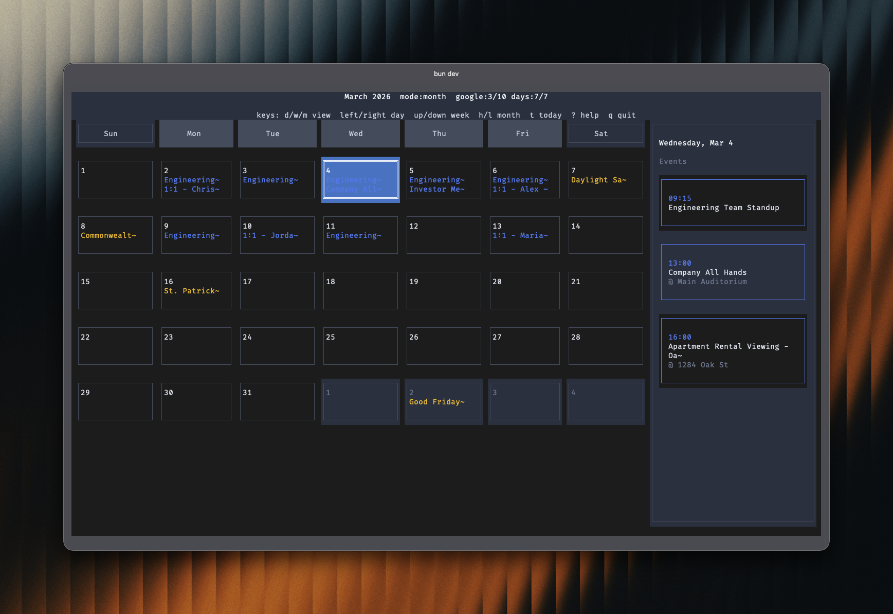

# LazyCal

A beautiful terminal-based Google Calendar interface built with [OpenTUI](https://github.com/anomalyco/opentui).



## Features

- Full day/week/month modes
- Responsive day columns (auto include/exclude days by terminal width)
- Time column always shown on the left in day/week views
- Built-in command hints in header plus full keyboard help modal (`?`)
- Side panel shows events for selected day (toggle with `s`, auto hides on narrow widths)
- Google Calendar API integration (optional)
- Color-coded events per calendar
- Resize-aware terminal UI

## Installation

```bash
npm install lazycal
```

## Usage

### Quick Start (with sample data)

```bash
npx lazycal
```

On first launch without credentials, LazyCal offers built-in guided onboarding for Google Calendar setup. You can skip anytime and continue with sample events.

You can also run with Bun directly:

```bash
bunx lazycal
```

### Connect to Google Calendar

To use real Google Calendar data:

1. **Create a Google Cloud Project:**
   - Go to [Google Cloud Console](https://console.cloud.google.com/)
   - Create a new project
   - Enable the Google Calendar API

2. **Create OAuth 2.0 Credentials:**
   - Go to "Credentials" in the left menu
   - Click "Create Credentials" -> "OAuth 2.0 Client ID"
   - Choose "Desktop application" as the application type
   - Download the JSON credentials file

3. **Configure LazyCal:**
   ```bash
   mkdir -p ~/.config/lazycal
   cp /path/to/downloaded/credentials.json ~/.config/lazycal/
   ```

4. **Run the app:**
   ```bash
   npx lazycal
   ```
   
   If credentials are missing, the app shows built-in onboarding steps and waits for `credentials.json`. After credentials are present, OAuth opens in your browser on first auth.

## Keyboard Shortcuts

| Key | Action |
|-----|--------|
| `d`, `w`, `m` | Switch to day / week / month view |
| `1`, `2`, `3` | Switch to day / week / month view |
| `left` / `right` | Previous / next day |
| `up` / `down` or `k` / `j` | Previous / next week |
| `h` / `l` | Previous / next month |
| `t` | Go to today |
| `c` | Toggle calendars selector |
| `s` | Toggle sidebar on/off |
| `r` | Refresh events from Google Calendar |
| `?` | Open keyboard help modal |
| `Enter` | View selected day details (logs to console) |
| `q` / `Ctrl+C` | Quit |

## Development

```bash
# Run in development mode
bun run dev

# Type checking
bun run typecheck
```

## License

MIT

## Acknowledgments

Built with [OpenTUI](https://github.com/anomalyco/opentui) - A powerful TypeScript library for building terminal user interfaces.
